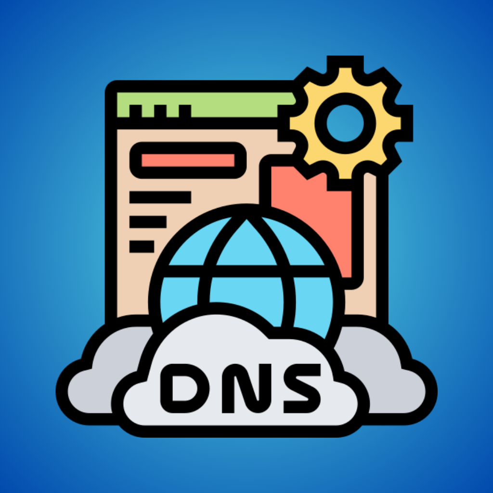

# DNS Manager

<p align="center">
  
</p>

<p align="center">
  <strong>Gerenciador de DNS Privado (DNS over TLS) para Android</strong>
</p>

<p align="center">
  
  
  
  
</p>

---

## 📱 Sobre o App

O **DNS Manager** é um aplicativo Android desenvolvido em Flutter para gerenciar configurações de DNS Privado (DNS over TLS - DoT) de forma simples e intuitiva.

### ✨ Funcionalidades

- 🔄 **Ativar/Desativar DNS Privado** com um toque
- 📋 **Lista de servidores DNS** populares pré-configurados (Cloudflare, Google, Quad9, AdGuard, etc.)
- ➕ **Adicionar servidores customizados** com nome, hostname e logo personalizado
- ⭐ **Favoritar servidores** para acesso rápido
- 👁️ **Ocultar servidores** da dashboard para personalização
- 🔀 **Reordenar servidores** com drag-and-drop
- ⚡ **Quick Settings Tile** para controle rápido na central de notificações
- 🎨 **Interface moderna** com Material Design 3 e tema escuro

---

## 🚀 Instalação

### Requisitos

- Android 9.0 (API 28) ou superior
- ADB instalado (para conceder permissão)

### Download

1. Baixe o APK da [página de releases](../../releases)
2. Instale o APK no seu dispositivo
3. Conceda a permissão especial via ADB (veja abaixo)

### ⚠️ Permissão Necessária

O Android não permite que apps configurem o DNS Privado sem uma permissão especial. Você precisa conceder via ADB:

```bash
adb shell pm grant com.dnsmanager.dns_manager android.permission.WRITE_SECURE_SETTINGS
```

**Nota:** Esta permissão precisa ser concedida novamente após reinstalar o app.

---

## 🛠️ Desenvolvimento

### Pré-requisitos

- Flutter SDK 3.6+
- Android SDK
- VS Code ou Android Studio

### Configuração

```bash
# Clone o repositório
git clone https://github.com/seu-usuario/dns-manager.git

# Entre no diretório
cd dns-manager

# Instale as dependências
flutter pub get

# Execute o app
flutter run
```

### Estrutura do Projeto

```
lib/
├── main.dart                 # Entry point
├── models/
│   └── dns_server.dart       # Modelo de servidor DNS
├── providers/
│   └── dns_provider.dart     # State management (Riverpod)
├── screens/
│   └── home_screen.dart      # Tela principal
├── services/
│   └── dns_service.dart      # Serviço de configuração DNS
├── theme/
│   └── app_theme.dart        # Tema do app
└── widgets/
    └── server_card.dart      # Widget de card do servidor

android/
├── app/src/main/
│   ├── kotlin/.../
│   │   ├── MainActivity.kt   # Activity principal
│   │   └── DnsTileService.kt # Quick Settings Tile
│   └── res/
│       └── drawable/         # Ícones e recursos
```

---

## 📦 Tecnologias Utilizadas

- **Flutter** - Framework de UI
- **Riverpod** - Gerenciamento de estado
- **SharedPreferences** - Persistência de dados
- **Flutter SVG** - Renderização de logos SVG
- **Image Picker** - Seleção de imagens customizadas

---

## 🌐 Servidores DNS Pré-configurados

| Provedor | Hostname | Descrição |
|----------|----------|-----------|
| Cloudflare | `1dot1dot1dot1.cloudflare-dns.com` | Rápido e focado em privacidade |
| Google | `dns.google` | Confiável e estável |
| Quad9 | `dns.quad9.net` | Bloqueio de malware |
| AdGuard | `dns.adguard.com` | Bloqueio de anúncios |
| NextDNS | `dns.nextdns.io` | Personalizável |
| OpenDNS | `doh.opendns.com` | Proteção familiar |

---

## 📄 Licença

Este projeto está sob a licença MIT. Veja o arquivo [LICENSE](LICENSE) para mais detalhes.

---

## 🤝 Contribuições

Contribuições são bem-vindas! Sinta-se à vontade para abrir issues ou pull requests.

---

<p align="center">
  Feito com ❤️ usando Flutter
</p>
