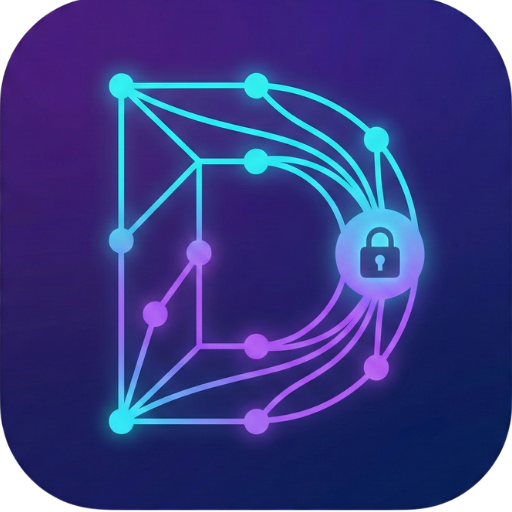

# DNS Manager

<p align="center">
  
</p>

<p align="center">
  <strong>🛡️ Seu DNS Privado Sob Controle</strong>
</p>

<p align="center">
  <a href="https://play.google.com/store/apps/details?id=com.dnsmanager.dns_manager">
    
  </a>
  
  
  
  
</p>

<p align="center">
  <a href="https://play.google.com/store/apps/details?id=com.dnsmanager.dns_manager">
    
  </a>
</p>

---

## 📱 Sobre o App

O **DNS Manager** é o aplicativo definitivo para gerenciar configurações de DNS Privado (DNS over TLS - DoT) no seu dispositivo Android. Com uma interface intuitiva e recursos avançados, você tem controle total sobre sua conexão de internet.

---

## ✨ Funcionalidades

### 🔒 DNS Privado Seguro
- Configure facilmente DNS over TLS (DoT) no seu Android
- Proteja suas consultas DNS contra interceptação
- Suporte a múltiplos provedores de DNS

### ⚡ Acesso Rápido
- **Quick Settings Tile** na barra de notificações
- **Widget na tela inicial** para status em tempo real
- Ative ou desative o DNS com um único toque

### 📊 Monitoramento em Tempo Real
- Notificação persistente com latência e tempo de conexão
- Histórico de uso com estatísticas detalhadas
- Verificação automática de conectividade

### 🎨 Interface Moderna
- Design Material 3 com temas claro e escuro
- Logos dos principais provedores DNS
- Cores personalizáveis para cada servidor

### 📦 Servidores Pré-configurados

| Provedor | Destaque |
|----------|----------|
| Cloudflare (1.1.1.1) | Rápido e focado em privacidade |
| Google DNS | Confiável e estável |
| Quad9 | Bloqueio de malware |
| AdGuard DNS | Bloqueio de anúncios |
| NextDNS | Personalizável e seguro |
| OpenDNS | Proteção familiar |

### ➕ Servidores Personalizados
- Adicione qualquer servidor DNS-over-TLS
- Logo personalizada e cores
- Organize com favoritos e reordenação (drag-and-drop)

### 🔧 Recursos Avançados
- Backup e restauração de configurações (JSON)
- Importar/exportar servidores
- Histórico de ativações com filtros
- Estatísticas de tempo de uso

### 📱 Configuração Facilitada

3 métodos para conceder a permissão necessária:

| Método | Descrição |
|--------|-----------|
| **USB + ADB** | Com computador (recomendado) |
| **App Shizuku** | Configuração inicial com PC, depois sem cabo |
| **App LADB** | 100% pelo celular (Android 11+) |

> 🎬 Tutoriais em vídeo do YouTube integrados para cada método!

---

## 🚀 Instalação

### Via Google Play (Recomendado)

<a href="https://play.google.com/store/apps/details?id=com.dnsmanager.dns_manager">
  
</a>

### Via APK (Download Direto)

1. Baixe o arquivo `app-release.apk` na [página de releases](../../releases)
2. No Android, vá em **Configurações > Segurança > Fontes desconhecidas** e ative
3. Abra o arquivo APK e toque em **Instalar**
4. Siga as instruções no app para conceder a permissão

---

## 📋 Requisitos

| Requisito | Valor |
|-----------|-------|
| **Android mínimo** | 9.0 (Pie) - API 28 |
| **Permissão especial** | `WRITE_SECURE_SETTINGS` via ADB |

---

## ⚠️ Permissão Necessária

O Android requer uma permissão especial para que apps configurem o DNS Privado. Você precisa conceder **uma única vez** via ADB:

```bash
adb shell pm grant com.dnsmanager.dns_manager android.permission.WRITE_SECURE_SETTINGS
```

> 💡 **Dica:** O app inclui instruções detalhadas e tutoriais em vídeo para cada método de configuração (USB + ADB, Shizuku, LADB).

> **Nota:** Esta permissão precisa ser concedida novamente apenas se você reinstalar o app.

---

## 🔐 Privacidade

- ✅ **Não coleta dados pessoais**
- ✅ **Funciona totalmente offline** após a configuração
- ✅ **Sem anúncios, sem rastreamento**
- ✅ **100% Open Source**

📄 Veja nossa [Política de Privacidade](PRIVACY_POLICY.md) completa.

---

## 🛠️ Desenvolvimento

### Pré-requisitos

- Flutter SDK 3.6+
- Android SDK
- VS Code ou Android Studio

### Configuração

```bash
# Clone o repositório
git clone https://github.com/Vini-Paixao/dns-manager.git

# Entre no diretório
cd dns-manager

# Instale as dependências
flutter pub get

# Execute o app
flutter run
```

### Estrutura do Projeto

```
lib/
├── main.dart                 # Entry point
├── models/
│   └── dns_server.dart       # Modelo de servidor DNS
├── providers/
│   └── dns_provider.dart     # State management (Riverpod)
├── screens/
│   ├── home_screen.dart      # Tela principal
│   ├── settings_screen.dart  # Configurações
│   └── history_screen.dart   # Histórico de uso
├── services/
│   └── dns_service.dart      # Serviço de configuração DNS
├── theme/
│   └── app_theme.dart        # Tema do app
└── widgets/
    └── server_card.dart      # Widget de card do servidor

android/
├── app/src/main/
│   ├── kotlin/.../
│   │   ├── MainActivity.kt       # Activity principal
│   │   ├── DnsTileService.kt     # Quick Settings Tile
│   │   ├── DnsWidgetProvider.kt  # Widget da tela inicial
│   │   └── DnsNotificationService.kt # Notificação persistente
│   └── res/
│       └── drawable/         # Ícones e recursos
```

---

## 📦 Tecnologias Utilizadas

| Tecnologia | Uso |
|------------|-----|
| **Flutter** | Framework de UI |
| **Kotlin** | Código nativo Android |
| **Riverpod** | Gerenciamento de estado |
| **SharedPreferences** | Persistência de dados |
| **Flutter SVG** | Renderização de logos |
| **URL Launcher** | Abertura de links externos |

---

## 🤝 Contribuições

Contribuições são bem-vindas! Sinta-se à vontade para:

- 🐛 Reportar bugs via [Issues](../../issues)
- 💡 Sugerir novas funcionalidades
- 🔧 Enviar Pull Requests

---

## 📄 Licença

Este projeto está sob a licença MIT. Veja o arquivo [LICENSE](LICENSE) para mais detalhes.

---

## ⭐ Apoie o Projeto

Se o DNS Manager foi útil para você:

- ⭐ Deixe uma estrela no repositório
- 📝 Avalie o app na Play Store
- 📢 Compartilhe com amigos

---

<p align="center">
  <a href="https://play.google.com/store/apps/details?id=com.dnsmanager.dns_manager">
    
  </a>
</p>

<p align="center">
  Desenvolvido com ❤️ usando Flutter e Kotlin
</p>

<p align="center">
  <a href="https://github.com/Vini-Paixao">@Vini-Paixao</a>
</p>
